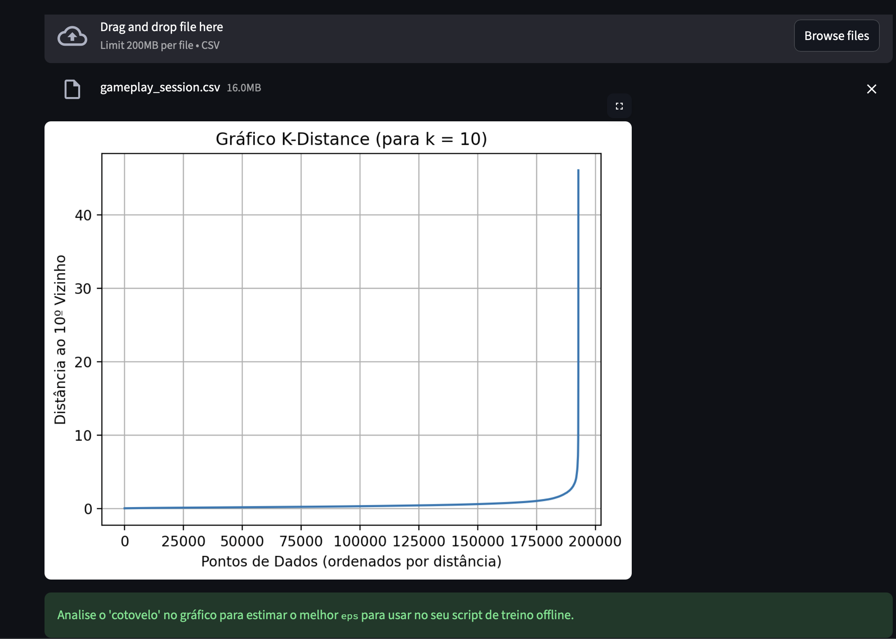
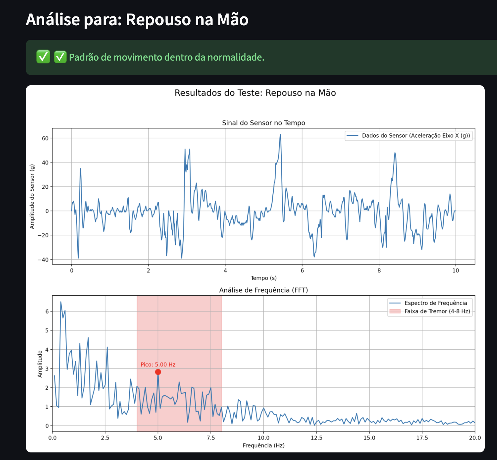
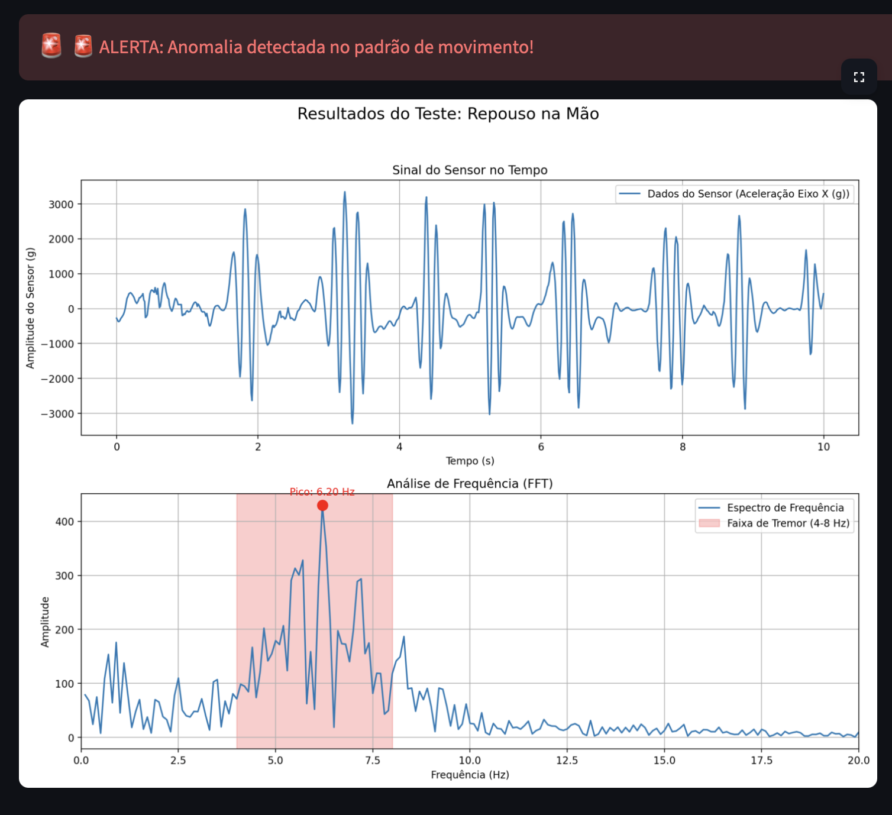

# RELATÓRIO TÉCNICO - APOLO
## Sistema de Detecção de Anomalias de Movimento

**Data:** 15 de dezembro de 2025  
**Autor:** Thauanny Kyssy Ramos Pereira  
**Versão:** 1.0

---

## 1. INTRODUÇÃO

O APOLO é um sistema de análise de sinais de movimento desenvolvido em Python que utiliza técnicas de processamento de sinais e aprendizado de máquina não supervisionado para detectar anomalias em padrões de movimento humano. O foco principal é a identificação de oscilações rítmicas características do tremor de repouso associado à doença de Parkinson.

### Escopo Técnico
- **Captura de dados:** Acelerómetro de controle DualSense (PS5) via USB
- **Processamento:** Transformada Rápida de Fourier (FFT), extração de features
- **Clusterização:** DBSCAN com métrica Euclidiana
- **Visualização:** PCA e t-SNE para redução dimensional
- **Ambiente:** Python 3.10+, Streamlit para interface web

---

## 2. FLUXO DE DADOS E PROCESSAMENTO

### 2.1 Coleta de Dados Brutos

A coleta é realizada através de:
- **Dispositivo:** Controle Sony DualSense (PS5) conectado via cabo USB
- **Sensor:** Acelerómetro e Giroscópioxs
- **Duração:** 10 segundos para cada teste (configurável via  `TEST_DURATION_SEC (config.py)`)

**Arquivo gerado para treino:** `gameplay_session.csv` (~16 MB para 15 minutos de jogo)

> **Dados de treino:** O arquivo `gameplay_session.csv` contém 15 minutos de captura contínua de movimento, incluindo acelerómetro, giroscópio e botões do controle DualSense.

#### Estrutura dos dados brutos

```csv
timestamp,accel_x,accel_y,accel_z,gyro_x,gyro_y,gyro_z,R1,L1,DpadUp,DpadDown,DpadLeft,DpadRight,L2_force,R2_force
1759605324.561212,0,2,-1,-87,7940,1437,0,0,False,False,False,False,False,False
```

**Colunas:**
- `timestamp`: Unix timestamp com precisão de milissegundos
- `accel_x, accel_y, accel_z`: Aceleração em 3 eixos (m/s²)
- `gyro_x, gyro_y, gyro_z`: Velocidade angular em 3 eixos (rad/s)
- `R1, L1, DpadUp, ...`: Botões do controle (estados digitais 0/1)

---

## 3. PROCESSAMENTO DE DADOS

### 3.1 Sanitização e Normalização

**Etapas de Sanitização:**

1. **Remoção de valores ausentes**
   - Verificação de NaNs e infinitos
   - Interpolação linear para gaps pequenos

2. **Normalização via StandardScaler**
   - Centraliza dados (média = 0)
   - Redimensiona para variância = 1
   - Fórmula: $z = \frac{x - \mu}{\sigma}$

3. **Segmentação em Janelas**
   - Tamanho da janela: 200 amostras (1 segundo)
   - Passo: 100 amostras (50% overlap)
   - Total de janelas: ~1927 para 30 minutos

### 3.2 Extração de Features

O sistema atualmente implementa apenas **Testes de Repouso (Tremor)** com 4 features:

| Feature | Descrição | Unidade |
|---------|-----------|---------|
| `peak_freq` | Frequência dominante na faixa de tremor (4-8 Hz) | Hz |
| `tremor_power` | Energia concentrada em 4-8 Hz | Amplitude² |
| `total_power` | Energia total do sinal | Amplitude² |
| `tremor_index` | Proporção: tremor_power / total_power | % |

**Dimensionalidade:** 4 features + 1 label (target) = 5D total

### 3.3 Processamento via Transformada Rápida de Fourier (FFT)

A **FFT (Fast Fourier Transform)** é o coração da análise de tremor no APOLO. Converte sinais no domínio do tempo para o domínio da frequência.

**Filtragem por faixa de frequência (4-8 Hz):**
- Extrai bins correspondentes apenas à faixa de tremor de Parkinson
- Remove frequências fora dessa banda (ruído de movimento, DC offset, etc.)
- Resultado: `tremor_power = soma das magnitudes em 4-8 Hz`


---

## 4. CLUSTERING COM DBSCAN

### 4.1 Configuração do Algoritmo

```python

DBSCAN(
    eps = 1.5              # Raio de vizinhança
    min_samples = 8        # Para 4 features: 2 × 4 = 8
)
```

**Parâmetros (em `config.py`):**

| Parâmetro | Valor | Descrição |
|-----------|-------|-----------|
| `DBSCAN_EPS` | 1.5 | Raio de vizinhança em espaço normalizado |
| `DBSCAN_MIN_SAMPLES` | 2 (multiplicador) | Heurística: 2 × num_features |
| `Num Features` | **4** | peak_freq, tremor_power, total_power, tremor_index |
| Cálculo Final | **8** | min_samples = 2 × 4 = 8 |
| `Métrica` | Euclidiana | Distância padrão do DBSCAN |


**Duração dos Testes:**
- `TEST_DURATION_SEC = 10` segundos (em config.py)
- Aplicado a cada teste de repouso na interface Streamlit

### 4.2 Interpretação dos dados ( k-distance)




---

## 5. REDUÇÃO DIMENSIONAL

### 5.1 (PCA + DBSCAN) | (t-SNE + DBSCAN)


---

## 6. DADOS UTILIZADOS E RESULTADOS


### 6.2 Resultados da Detecção

**Caso 1: Padrão Normal (Baseline)**



**Caso 2: Anomalia Detectada**




---

## 7. ARQUITETURA DE SOFTWARE

## 📂 Arquivos Principais do Projeto

```
config.py                          ← Configuração centralizada (DBSCAN, tremor, etc.)
gravacao_jogo_dados_controle.py    ← Gera gameplay_session.csv
treinar_modelo_local.py            ← Treina analyzer_model.joblib
main.py                            ← Lança a interface Streamlit

src/analysis/
    ├─ signal_analyzer.py          ← FFT (coração da análise)
    ├─ feature_extractor.py        ← 4 features por teste
    ├─ session_processor.py        ← Divide em janelas
    └─ cluster_analyzer.py         ← DBSCAN + redução dimensional (Singleton)

src/app/
    └─ streamlit_ui.py             ← Interface web
```

## 8. CONCLUSÕES E LIMITAÇÕES

### Pontos Fortes
✅ Detecção eficaz de padrões anormais em movimento  
✅ Processamento em tempo real (< 1 segundo por teste)  
✅ Adaptável a padrões individuais via baseline pessoal  
✅ Interface intuitiva baseada em web  
✅ Arquitetura limpa com padrão Singleton  
✅ Configuração centralizada e facilmente ajustável  

### Limitações
⚠️ Suportado apenas via USB (sem Bluetooth no macOS)  
⚠️ Sensores de console não calibrados para uso médico  
⚠️ Variabilidade entre diferentes controles  
⚠️ Requer 15+ minutos para treino adequado  

### Recomendações Futuras
- Expansão para outros tipos de testes (Finger Tapping, Pronação-Supinação)
- Integração com modelos Deep Learning (LSTM, CNN)
- Sincronização com wearables médicos
- Base de dados agregada para análise populacional
- Validação clínica com pacientes reais

---
**Status:** Ambiente Experimental  

